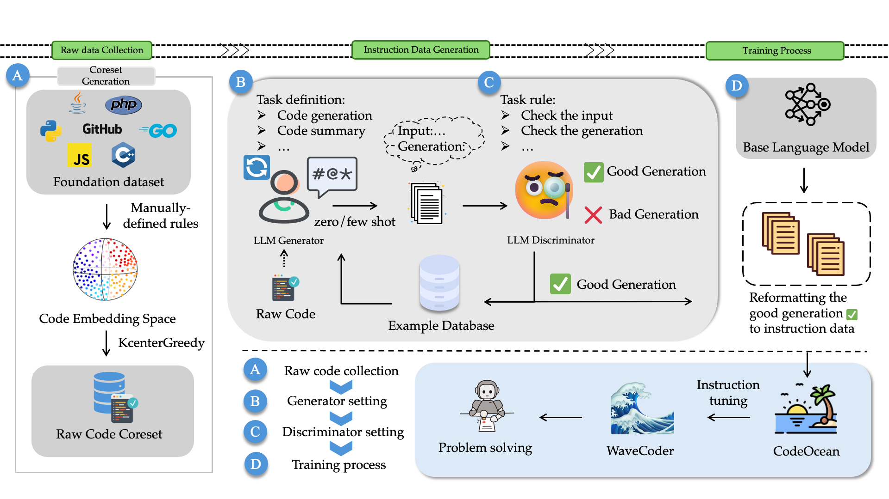
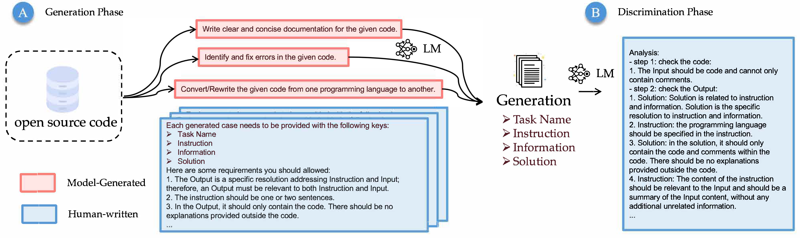
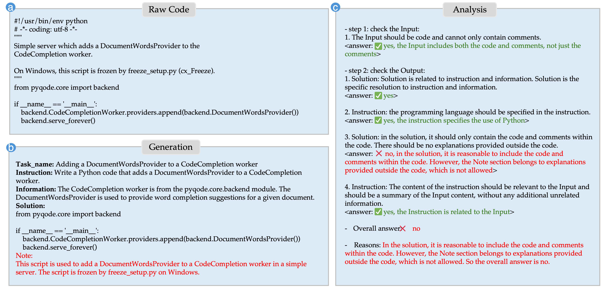
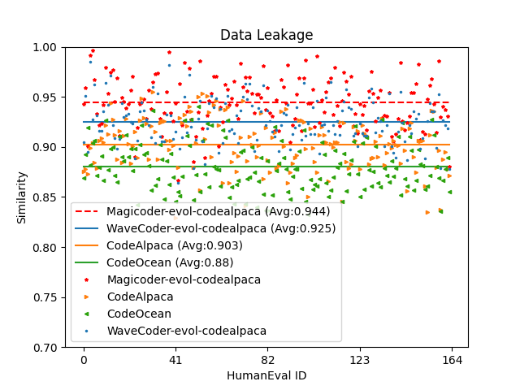
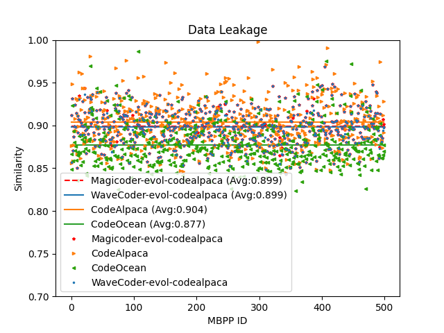

<h1 align="center">

<br>
WaveCoder: Widespread And Versatile Enhanced Code LLM
</h1>

<div align="center">


</div>

<p align="center">
  <a href="https://arxiv.org/abs/2312.14187"><b>[📜 Paper]</b></a> •
  <!-- <a href=""><b>[🤗 HF Models]</b></a> • -->
  <a href="https://huggingface.co/microsoft/wavecoder-ultra-6.7b"><b>[🤗 HF Models]</b></a> •
  <a href="https://github.com/microsoft/WaveCoder"><b>[🐱 GitHub]</b></a>
  <br>
  <a href="https://twitter.com/TeamCodeLLM_AI"><b>[🐦 Twitter]</b></a> •
  <a href="https://www.reddit.com/r/LocalLLaMA/comments/19a1scy/wavecoderultra67b_claims_to_be_the_2nd_best_model/"><b>[💬 Reddit]</b></a> •
  <a href="https://www.analyticsvidhya.com/blog/2024/01/microsofts-wavecoder-and-codeocean-revolutionize-instruction-tuning/">[🍀 Unofficial Blog]</a>
  <!-- <a href="#-quick-start">Quick Start</a> • -->
  <!-- <a href="#%EF%B8%8F-citation">Citation</a> -->
</p>

<p align="center">
Repo for "<a href="https://arxiv.org/abs/2312.14187" target="_blank">WaveCoder: Widespread And Versatile Enhanced Instruction Tuning with Refined Data Generation</a>" [ACL 2024 Main]
</p>

<p align="center">
    
        <br>
    <em>Figure 1: WaveCoder models pipeline.</em>
</p>

## 🔥 News

<!-- - [2023/10/13] 🔥🔥🔥 We release a demo for WaveCoder at [🐯 Gradio](https://955</p></p>7c5365a6f44dc84.gradio.live), try it out!!! -->

- [2024/05/16] WaveCoder paper is accepted by main conference of ACL 2024.
- [2024/04/10] 🔥🔥🔥 WaveCoder repo, models released at [🤗 HuggingFace]()!
- [2023/12/26] WaveCoder paper released.

## 💡 Introduction

WaveCoder 🌊 is a series of large language models (LLMs) for the coding domain, designed to solve relevant problems in the field of code through instruction-following learning. Its training dataset was generated from a subset of code-search-net data using a generator-discriminator framework based on LLMs that we proposed, covering four general code-related tasks: code generation, code summary, code translation, and code repair.

| Model                                                                                                                         | HumanEval | MBPP(500) | HumanEval<br>Fix(Avg.) | HumanEval<br>Explain(Avg.) |
| ----------------------------------------------------------------------------------------------------------------------------- | --------- | --------- | ---------------------- | -------------------------- |
| GPT-4                                                                                                                         | 85.4      | -         | 47.8                   | 52.1                       |
| [ WaveCoder-DS-6.7B](https://github.com/microsoft/WaveCoder)             | 65.8      | 63.0      | 49.5                   | 40.8                       |
| [ WaveCoder-Pro-6.7B](https://github.com/microsoft/WaveCoder)   | 74. 4     | 63.4      | 52.1                   | 43.0                       |
| [ WaveCoder-Ultra-6.7B](https://github.com/microsoft/WaveCoder) | 79.9      | 64.6      | 52.3                   | 45.7                       |

### LLM-based Generator-Discriminator

<p align="center">
    
    <br>
    <em>Figure 2: Main framwork of LLM-based Generator-Discriminator.</em>
</p>

### Example of Instruction Generation

<p align="center">
    
    <br>
    <em>Figure 3: An Example of Our Data Generation.</em>
</p>

### Data Decontamination

We combine our dataset with the decontaminated [evol-codealpaca-v1](https://huggingface.co/datasets/theblackcat102/evol-codealpaca-v1) dataset (WaveCoder-evol-instruct) to train WaveCoder-Ultra-6.7B.

<!-- <figure class="half">
  
  
  <br>
</figure> -->
<table>
    <tr>
        <td ><center></center></td>
        <td ><center></td>
    </tr>
</table>

## 🚀 Quick Start

### ⚙️ Setup

We recommend using [Conda](https://docs.conda.io/projects/miniconda) to manage your environment. Run the following commands to setup your environment:

```sh
conda create -n wavecoder python=3.9
conda activate wavecoder
cd src
pip install -r requirements.txt
pip install transformers==4.34.1
pip install flash-attn==2.5.5
```

### ⚡️ Training

We also open-source our complete training scripts for the community, and you may construct your own dataset for training. Our training scripts refer to [Fastchat](https://github.com/lm-sys/FastChat)

To train a model, run the following command:

```sh
cd src
bash script/train.sh
```

### ⚖️ Evaluation

- For [HumanEval](https://huggingface.co/datasets/openai_humaneval) benchmark, we use the code base from [Evalplus](https://github.com/evalplus/evalplus). We recommend using the code base from [Magicoder](https://github.com/ise-uiuc/magicoder) and the following command to reproduce the HumanEval result of WaveCoder.

```sh
MODEL_KEY=deepseek-ai/deepseek-coder-6.7b-base
MODEL=microsoft/wavecoder-ultra-6.7b

DATASET=humaneval
SAVE_PATH=evalplus-$(basename $MODEL)-$DATASET.jsonl
SANITIZED_PATH=humaneval_result/evalplus-$(basename $MODEL)-$DATASET-sanitized.jsonl

python -m experiments.text2code \
  --model_key $MODEL_KEY \
  --model_name_or_path $MODEL \
  --save_path $SAVE_PATH \
  --dataset $DATASET \
  --temperature 0.0 \
  --top_p 1.0 \
  --max_new_tokens 512 \
  --n_problems_per_batch 28 \
  --n_samples_per_problem 1 \
  --n_batches 1

echo "$MODEL"
evalplus.evaluate --dataset $DATASET --samples $SAVE_PATH
```

- For MBPP (500), you can get generations by running the following command:

```sh
cd src
bash script/generate.sh
```

and then get a pass_k score and the error type analysis by running the following command:

```sh
bash script/evaluate.sh
```

- For HumanEvalFix and HumanEvalExplain benchmarks, we use the code base from [bigcode-evaluation-harness](https://github.com/bigcode-project/bigcode-evaluation-harness).

### 🌲 Data Generation

Firstly, you should prepare your raw code data and save it as .jsonl file, then you can run the following command:

```sh
cd src
bash script/coreset.sh
```

to get the coreset of you raw data. Once you get the coreset, you can run

```sh
cd src
bash script/data_generate.sh
```

to launch the LLM-based Generator-Discriminator framework. You can customize your data by controlling the prompt and the configurations in the above .sh script.

## 📖 License

This code repository is licensed under the MIT License. The use of DeepSeek Coder models is subject to the its [License](https://github.com/deepseek-ai/DeepSeek-Coder/blob/main/LICENSE-MODEL).

## ☕️ Citation

If you find this repository helpful, please consider citing our paper:

```
@article{yu2023wavecoder,
  title={Wavecoder: Widespread and versatile enhanced instruction tuning with refined data generation},
  author={Yu, Zhaojian and Zhang, Xin and Shang, Ning and Huang, Yangyu and Xu, Can and Zhao, Yishujie and Hu, Wenxiang and Yin, Qiufeng},
  journal={arXiv preprint arXiv:2312.14187},
  year={2023}
}
```

## 🍀 Contributing

This project welcomes contributions and suggestions. Most contributions require you to agree to a
Contributor License Agreement (CLA) declaring that you have the right to, and actually do, grant us
the rights to use your contribution. For details, visit https://cla.opensource.microsoft.com.

Resources:

- [Microsoft Open Source Code of Conduct](https://opensource.microsoft.com/codeofconduct/)
- [Microsoft Code of Conduct FAQ](https://opensource.microsoft.com/codeofconduct/faq/)
- Contact [opencode@microsoft.com](mailto:opencode@microsoft.com) with questions or concerns

## ✨ Star History

[](https://star-history.com/#microsoft/WaveCoder&Date)
